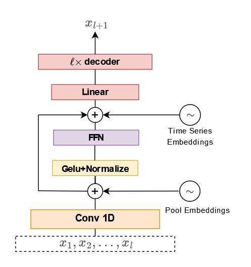

# One for All: A Method for forecasting multiple time series in a univariate sense using a single model.
Some files related to the upcoming manuscript which revolves around ensemble learning for time series forecasting using transformers.

## Model Details

1) Though there are moderate differences, this is a classical decoder type transformers model for time series prediction. First minor difference is that we concatenate the positional embeddings after convolutional layer instead adding them pointwise. We should point out that we concatenate learned positional embeddings to the convolved outputs, not to individual values of ${x_i}$.  To let the model differentiate the time series fed, we add the same vector to each input, before the main transformer layers. 

3) $[x_1, x_2,\cdots, x_{\ell}]$ is fed to convolution layer slicing it into sliding patches, depending on your kernel choice. The rest of the job, then, is done in transformer blocks. 

2) We pad some zeroes from the left to make the model isotropic, this way we believe that the model turned out to be autoregressive. 

3) We initialized the layers with very low variance. This, as expected, accelareted convergence. 

4) For training procedure, we used Adamw with learning rate 0.0001 and weight decay 0.1. 

## Some Details About the .py Files

1) layers.py contains some of the layers to be used. For the sake of completeness we implement our own layers,

2) preprocess_train_test.py will contain necessary functions to grab the data out of csv files and do some preprocessing and prepare them. If necessary feel free to hack!

3) convert_memmap.py will grab csv files convert them into data.dat and lengths.dat files. 

4) memmap_arrays.py is a signature snippet, grabbing data.dat and lengths.dat files, and will give you a window of given size from your concatted time series, as $X[:-1]$, $X[-1]$ and place_, where place_ indicates which time series to be used. The idea here is to feed the model the time series without any wrong mixture such as $[x_1, x_2, x_3, x_4, x_4, x_6, y_1, y_2, y_3, y_5, y_6, ..., y_{\ell}] \rightarrow$ Model, where ${x_i}$ and ${y_i}$ are different time series. We always have Model($[x_1, x_2, x_3, x_4, x_4, x_6, ..., x_{\ell}]$) is approximately $x_{\ell+1}$. Depending on the length of the time series and look behing window size, ts_concatted class will determine the jump points. 

5) RF.py is used to do old-school machine learning analysis -  given that all csv.files are preprocessed - you can choose for instance randomforest or KNN sort of old school stuff. Splitting of time series is done on the fly. Multiprocessing is supported. At the end of the procedure, a file will be provided to see the results. 

6) validate.py is for validation purposses. It will return a csv file, where the first column is the predicted and the second is the true value, and the third contains the name of the series. See the arguments for details. Do not forget to set compile True, otherwise inference takes a lot of time. 

8) Use as many GPUs as you like. DDP is implemented!!!

9) Train loss and validation loss calculations are done directly on GPUs, and reduced via NCCL.

10) In main_model.py Model class contains generate method which is effectively implemented, therefore can be used for doing longterm forecasts.

  
